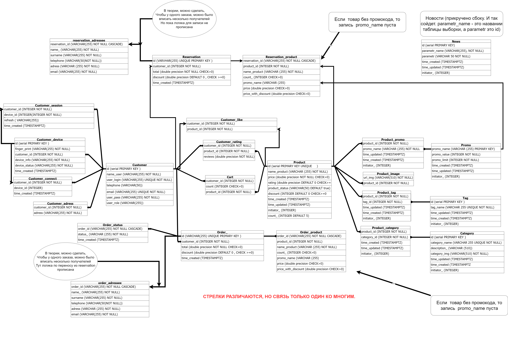

# Привет!
Меня зовут Ренат, я начинающий веб-специалист. На данный момент очень ищу место, где бы смог применить изученные навыки, развиваться, поучаствать в __настоящих проектах__.

## Стек
Front-END:

* HTML
* SCSS
* BEM
* Отзывчивая верстка
* JavaScript
* Vue3 (Vuex + Router)

BACK-END не является целью в поиске работы, но было интересно. Применял:

* Node.js
* Express
* PostgreSQL
* MongoDB

### Практика: 
Про код: большинство работ носят черновой, учебный характер и изначально не готовились к демонстрации.
*	Одностаничник. (html, scss, немного js). Создавался на начальном этапе обучения. Без макета.
Демо: [Просто вёрстка](https://rti30.github.io/cafeOld/)
*	Немного вёрстки в процессе обучения с использованием Vue3 (html, scss, vue). 
Демо: [демо Вёрстка + vue3](https://rti30.github.io/knife-demo/)
Репозиторий: [код здесь](https://github.com/rti30/Knife/)

*	Игра 2048 на чистом js. 
Демо: [демо игры 2048](https://module2-demo.vercel.app/)
Репозиторий: [код здесь](https://github.com/rti30/rat/tree/main/m2)
Задания на данный момент выкладываются на бесплатном учебном курсе от Ratio. Возможно будут интересные работы [в этом](https://github.com/rti30/rat) репозитории.

*	Проект с yotube API. (Думаю нужно было использовать какой-нибудь "vue-youtube", а не писать через iframe). Лоин/пароль см. в описании к репозиторию. 
Демо: [демо здесь](https://rti30.github.io/test-task-1-demo/)
Репозиторий: [код здесь](https://github.com/rti30/task-test-1)

*	Интернет-магазин цветов. Первый проект на VUE3. Первый проект в плне Backend. Прошу не обращать внимание на вёрстку. Создан для изучения фреймворка и программирования в целом. Некий полигон кода. Уж точно не для демонстрации. 
Демо: [демо здесь](https://flowerfront.herokuapp.com/)

Пример кода:  [код здесь](https://github.com/rti30/flower-front.git)
Репозиторий Back-end: [backend](https://github.com/rti30/flower-back)

Схема базы данных. Реализовано не всё. 

### Планы

В планах начать изучать NUXT.  (Судя по вакансиям надо было изучать React 🌝) Подробнее изучить конфигурацию сборщиков. Дальнейший вектор обучения, думаю, во многом зависит от стека работадателя. Готов обучаться.
Сам я из Астрахани, готов к удалёнке. Если успешно пройду стажировку — к перезду тоже.
* [Доп информация](https://drive.google.com/file/d/1ygGz3bWQ4RM8TkQSs6tfbMhprEcWtBRY/view?usp=sharing)
---
Всего доброго! 👋
